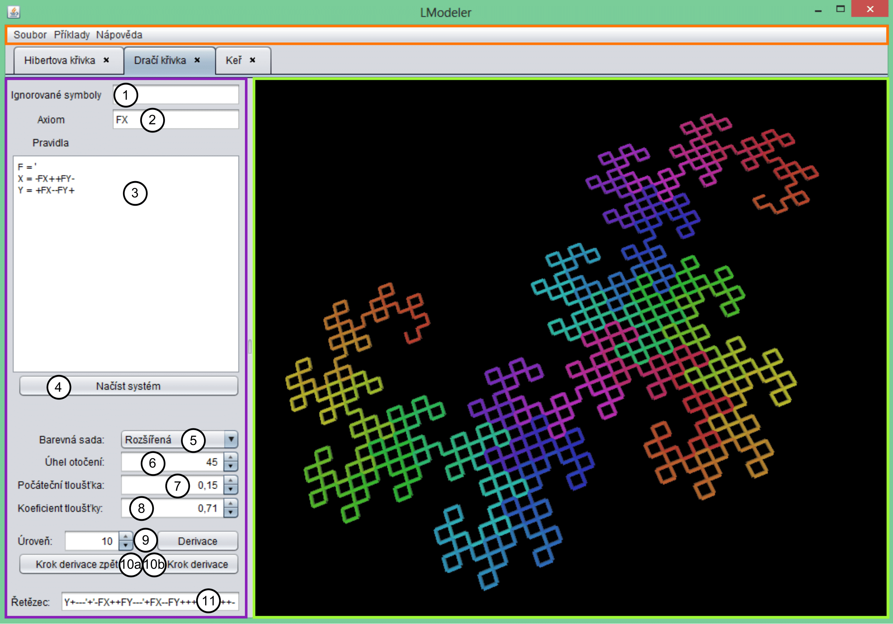
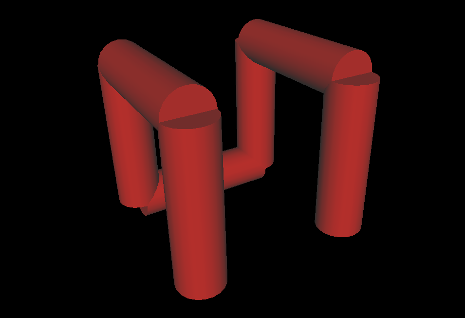
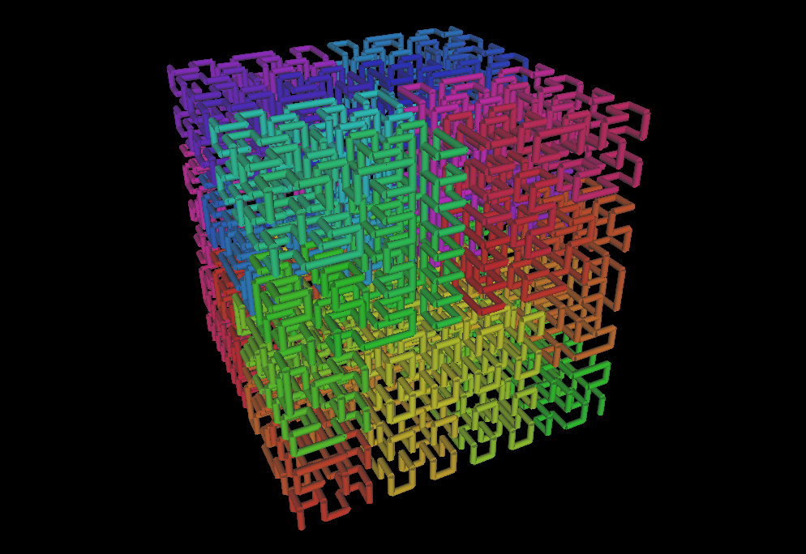
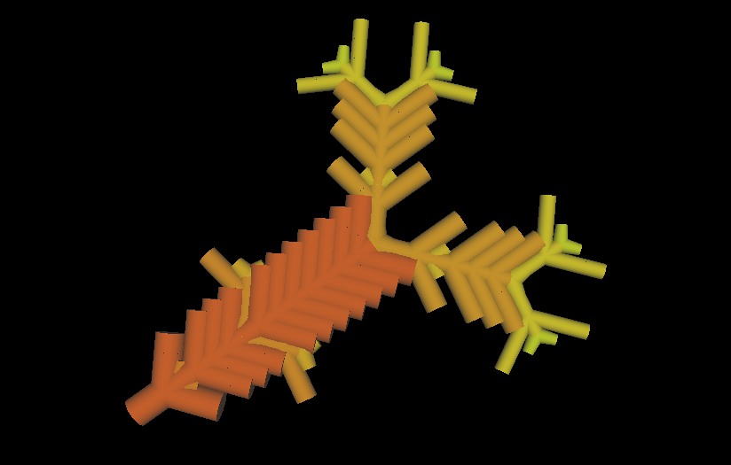
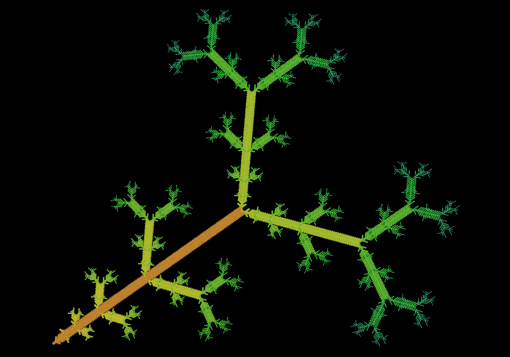
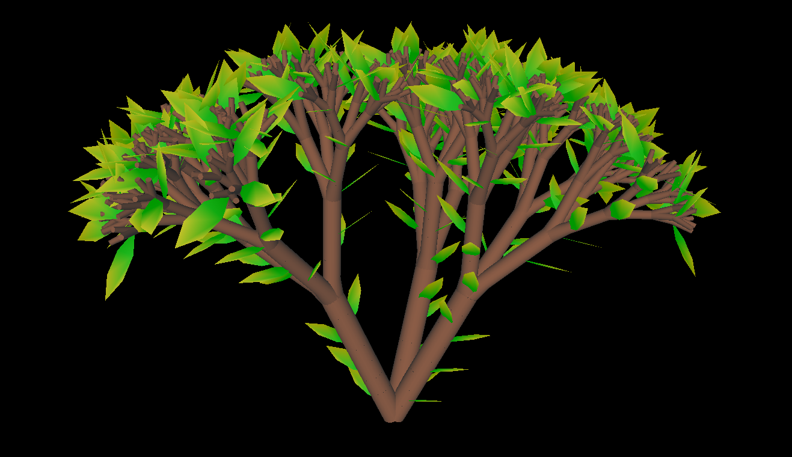
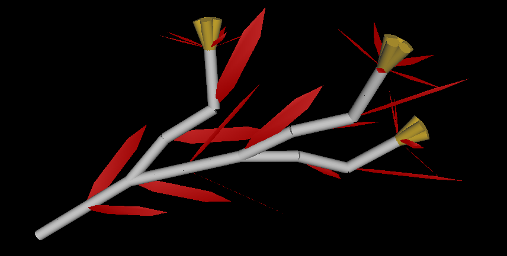

#LSystemModeller

Creation of 3D models based on L-systems rules input.

Written in Java with Netbeans. Netbeans project attached.

Winter 2013

## Author
* Jakub Kvita - kvitajakub@gmail.com

## Gallery

